# KirayaBahi architecture and module workflows

This document explains how the React Native application, local SQLite database, Firebase services, and scheduled backend function work together. KirayaBahi is **offline-first**: the mobile app writes to SQLite first, so normal rent-management work remains available without an internet connection. When a landlord signs in and a connection is available, the sync service copies changes between SQLite and Firestore.

## Architecture at a glance

This plain-text diagram works in every Markdown viewer:

```text
                         LANDLORD
                             │
                             ▼
              ┌──────────────────────────┐
              │  React Native Mobile App │
              │     Android and iOS      │
              └─────────────┬────────────┘
                            │
              ┌─────────────▼────────────┐
              │ Screens and Navigation   │
              │ Dashboard, Tenant, Rent  │
              └─────────────┬────────────┘
                            │
              ┌─────────────▼────────────┐
              │ Zustand Stores/Services  │
              │ State and Business Rules │
              └─────────────┬────────────┘
                            │
              ┌─────────────▼────────────┐
              │  SQLite Repositories     │
              │  Local Source of Truth   │
              └─────────────┬────────────┘
                            │
                   Save locally first
                            │
              ┌─────────────▼────────────┐
              │ Pending Sync Queue       │
              └─────────────┬────────────┘
                            │ Internet available
                            ▼
              ┌──────────────────────────┐
              │ Firebase Authentication  │
              └─────────────┬────────────┘
                            │ User ID
              ┌─────────────▼────────────┐
              │ Cloud Firestore          │
              │ Backup and Device Sync   │
              └─────────────┬────────────┘
                            │
              ┌─────────────▼────────────┐
              │ Firebase Cloud Functions │
              │ Daily Reminder Scheduler │
              └─────────────┬────────────┘
                            │
              ┌─────────────▼────────────┐
              │ Firebase Cloud Messaging │
              │ Push Reminder to Owner   │
              └──────────────────────────┘

 Optional tenant ID proof flow:

 React Native App ──upload──▶ Firebase Storage
        │
        └──file metadata────▶ SQLite ──sync──▶ Firestore
```

## Main module workflow

```text
┌──────────────┐
│  Onboarding  │
│ Landlord info│
└──────┬───────┘
       │
       ▼
┌──────────────┐     ┌──────────────┐     ┌──────────────┐
│   Property   │────▶│ Room / Unit  │────▶│    Tenant    │
└──────────────┘     └──────────────┘     └──────┬───────┘
                                                │
                         ┌──────────────────────┼──────────────────────┐
                         │                      │                      │
                         ▼                      ▼                      ▼
                  ┌─────────────┐       ┌─────────────┐       ┌─────────────┐
                  │ Rent Cycle  │       │  Reminder   │       │  Move-out   │
                  │ Monthly bill│       │ WhatsApp/FCM│       │ Settlement  │
                  └──────┬──────┘       └─────────────┘       └──────┬──────┘
                         │                                           │
                         ▼                                           ▼
                  ┌─────────────┐                            ┌────────────────┐
                  │   Payment   │                            │ Deposit/refund │
                  │ Full/partial│                            │ Final transfer │
                  └──────┬──────┘                            └────────────────┘
                         │
                         ▼
                  ┌─────────────┐
                  │   Receipt   │
                  │ Share / PDF │
                  └──────┬──────┘
                         │
                         ▼
                  ┌─────────────┐
                  │ Correction  │
                  │ Void + audit│
                  └─────────────┘
```

## Detailed workflow for each module

Every module below follows the same documentation format:

- **Intent** explains why the module exists.
- **Starts from** explains how the landlord enters the workflow.
- **Reads and writes** identifies its data boundary.
- **Workflow** shows the screen and data movement in plain text.

### 1. Onboarding and authentication

**Intent:** Give the landlord access to existing local records, optionally connect a Firebase account, and collect the profile details used on receipts and reminders.

**Starts from:** Application launch.

**Reads and writes:** Firebase Authentication, local settings, cloud profile settings, and the local-owner identity used to prevent two accounts from mixing data.

```text
┌──────────────────┐
│ Launch App       │
└────────┬─────────┘
         ▼
┌──────────────────┐
│ Open SQLite      │
│ Run migrations   │
└────────┬─────────┘
         ▼
┌──────────────────┐
│ Check Firebase   │
│ authentication   │
└────────┬─────────┘
         │
     ┌───┴────────────────────┐
     │                        │
     ▼                        ▼
Signed in                 Not signed in
     │                        │
     ▼                  ┌─────┴───────────┐
Verify local owner       │                 │
     │                   ▼                 ▼
     ▼              Connect account   Continue offline
Initial cloud sync       │                 │
     │                   └────────┬────────┘
     └────────────────────────────┘
                                  ▼
                       Onboarding completed?
                            │           │
                           No          Yes
                            │           │
                            ▼           ▼
                    Landlord setup   Main tabs
```

The app waits briefly for Firebase's initial auth result. If Firebase cannot respond, local access remains available through offline mode. After sign-in, `authStore` starts cloud sync before `appStore` loads screen data.

**Main files:** `src/app/useAppStartup.ts`, `src/app/AppNavigator.tsx`, `src/store/authStore.ts`, `src/services/authService.ts`, and `src/modules/onboarding`.

### 2. Dashboard module

**Intent:** Show the landlord the current month's collection position and provide shortcuts to the most common actions.

**Starts from:** The **Dashboard** bottom tab.

**Reads and writes:** Reads current-month rent cycles, tenant/property labels, landlord settings, and sync status. It does not directly create financial records; action buttons open the appropriate module.

```text
┌─────────────────────┐
│ Open Dashboard tab  │
└──────────┬──────────┘
           ▼
┌────────────────────────────┐
│ Refresh all local data     │
│ Ensure current rent cycles │
└──────────┬─────────────────┘
           ▼
┌────────────────────────────┐
│ Calculate current month    │
│                            │
│ Expected rent              │
│ Collected amount           │
│ Pending amount             │
│ Overdue tenant count       │
└──────────┬─────────────────┘
           ▼
┌────────────────────────────┐
│ Show summary and due list  │
└──────────┬─────────────────┘
           │
     ┌─────┼──────────────┬────────────────┐
     ▼     ▼              ▼                ▼
Add tenant  Record rent  Open ledger   Open settlement
```

The collection percentage is `collected ÷ expected`. Settled tenants are removed from pending and overdue totals. The sync badge reports whether records are local, syncing, synced, pending, or need attention.

**Main files:** `src/modules/dashboard/DashboardScreen.tsx`, `src/store/appStore.ts`, and `src/database/repositories/rentRepo.ts`.

### 3. Properties and units module

**Intent:** Represent the landlord's real-world inventory before a tenant is assigned. A property contains rooms, flats, shops, or other rentable units.

**Starts from:** The **Properties** bottom tab, or the tenant form when no suitable unit exists.

**Reads and writes:** `properties` and `units` in SQLite; both entities are added to the cloud sync queue. The list also derives total and occupied-unit counts.

```text
┌──────────────────────┐
│ Open Properties tab  │
└──────────┬───────────┘
           ▼
┌────────────────────────────┐
│ List properties            │
│ Name, type, address        │
│ Occupied / total units     │
└──────────┬─────────────────┘
           │
     ┌─────┴──────────────────────────┐
     │                                │
     ▼                                ▼
Add property                    Open property
     │                                │
     ▼                     ┌──────────┴──────────┐
Enter identity, type,      │ Property details   │
address, and units         │ and unit list      │
     │                     └──────────┬──────────┘
     ▼                                │
Validate form                 ┌───────┼──────────────┐
     │                        ▼       ▼              ▼
     ▼                    Add unit  Edit unit   Edit property
Save property                    │
and configured units             ▼
     │                    Name + monthly rent
     ▼                    + occupancy status
SQLite transaction               │
     │                            ▼
     ├──▶ Refresh app data    Save to SQLite
     └──▶ Queue cloud sync        │
                                  ├──▶ Vacant: tenant can be added
                                  └──▶ Occupied: unavailable for assignment
```

The normal business order is:

```text
Property ──contains──▶ Unit ──assigned to──▶ Tenant
```

A vacant unit exposes **Add tenant**. Assigning an active tenant changes the unit to occupied. A completed move-out changes it back to vacant when no active tenant remains.

**Main files:** `src/modules/properties`, `src/database/repositories/propertyRepo.ts`, and `src/database/repositories/unitRepo.ts`.

### 4. Tenants module

**Intent:** Store each tenancy agreement, contact information, financial terms, optional ID proof, current rent position, and payment history.

**Starts from:** The **Tenants** tab, **Add Tenant** on the dashboard, or **Add tenant** inside a vacant unit.

**Reads and writes:** `tenants`, `units`, current rent cycles, payments, settlements, and optional Firebase Storage objects.

```text
┌─────────────────────┐
│ Open Tenants tab    │
└──────────┬──────────┘
           ▼
┌────────────────────────────┐
│ Search and filter tenants  │
│ All / paid / partial /     │
│ overdue / unpaid           │
└──────────┬─────────────────┘
           │
     ┌─────┴──────────────────────────┐
     │                                │
     ▼                                ▼
Add tenant                    Open tenant detail
     │                                │
     ▼                  ┌─────────────┼──────────────────┐
Choose vacant unit      ▼             ▼                  ▼
     │              Current rent  Payment history   Tenant profile
     ▼                  │             │                  │
Enter identity, rent,   │             └──▶ Receipt       ├──▶ Edit
electricity, due day,   ├──▶ Update electricity          ├──▶ Call
deposit, and notes      ├──▶ Record payment              ├──▶ ID proof
     │                  └──▶ Send reminder               └──▶ Move out
     ▼
Optional ID proof?
     │
 ┌───┴───────────────┐
 │                   │
No                  Yes
 │                   │
 │              Signed in?
 │                │     │
 │               No    Yes
 │                │     │
 │          Save details│
 │          without file▼
 │                  Upload to
 │              Firebase Storage
 └───────────┬───────────┘
             ▼
 Save tenant in SQLite
 Occupy selected unit
 Queue cloud sync
```

Only vacant units are offered for a new tenant. While editing, the tenant's current unit remains selectable. ID-proof upload requires a connected cloud account, but failure to upload the file does not discard successfully saved tenant details.

**Main files:** `src/modules/tenants`, `src/database/repositories/tenantRepo.ts`, and `src/services/idProofService.ts`.

### 5. Ledger and rent-cycle module

**Intent:** Provide the month-by-month financial khata for every active or settled tenancy. A rent cycle is one tenant's bill for one calendar month.

**Starts from:** The **Ledger** bottom tab, **Open Khata** on the dashboard, or tenant detail.

**Reads and writes:** `rent_cycles`, effective non-voided payment totals, tenant/unit/property labels, and settlement links. Recording or updating a bill changes SQLite and queues cloud sync.

```text
┌──────────────────────┐
│ Open Ledger tab      │
└──────────┬───────────┘
           ▼
┌──────────────────────────────┐
│ Select month and year        │
└──────────┬───────────────────┘
           ▼
┌──────────────────────────────┐
│ Ensure rent cycle exists     │
│ for each eligible tenant     │
└──────────┬───────────────────┘
           ▼
┌──────────────────────────────┐
│ Read ledger from SQLite      │
│ Join tenant, unit, property, │
│ payments, and settlement     │
└──────────┬───────────────────┘
           ▼
┌──────────────────────────────┐
│ Apply filters                │
│                              │
│ Status and property          │
└──────────┬───────────────────┘
           ▼
┌──────────────────────────────┐
│ Show account                 │
│ Rent + electricity = bill    │
│ Paid and remaining balance   │
│ Due date and status          │
└──────────┬───────────────────┘
           │
     ┌─────┼──────────────────────┐
     ▼     ▼                      ▼
Mark paid  Record partial     View settlement
     │      payment               │
     └──────────┬─────────────────┘
                ▼
          Refresh ledger
```

The main calculations are:

```text
Total payable = Monthly rent + Electricity
Total paid    = Sum of non-voided payments
Balance       = Total payable - Total paid

Balance = 0                       ──▶ Paid
0 < Balance < Total payable       ──▶ Partial
Balance > 0 before/at due date    ──▶ Unpaid
Balance > 0 after due date        ──▶ Overdue
Final settlement exists          ──▶ Settled
```

Changing month or a filter reloads only the matching ledger. **Mark paid** records the full remaining balance as a cash payment dated today. **Record payment** opens the detailed form for partial payment or another payment method.

**Main files:** `src/modules/ledger/MonthlyLedgerScreen.tsx`, `src/services/rentCycleService.ts`, `src/services/rentStatus.ts`, and `src/database/repositories/rentRepo.ts`.

### 6. Payments and receipts module

**Intent:** Record money actually received, update the rent balance safely, and create a permanent receipt that can be viewed, shared, saved as PDF, or voided with an audit reason.

**Starts from:** Dashboard, ledger, tenant list, or tenant detail.

**Reads and writes:** `payments`, `rent_cycles`, receipt snapshot fields, and sync queue entries. PDF files are generated on the device.

```text
Rent cycle selected
        │
        ▼
Enter payment amount,
date, mode, reference
        │
        ▼
Validate against balance
        │
        ▼
Atomic SQLite transaction
        │
        ├──▶ Save payment and receipt snapshot
        ├──▶ Recalculate paid amount and balance
        └──▶ Queue payment and rent-cycle sync
        │
        ▼
Open receipt preview
        │
   ┌────┼───────────────┐
   ▼    ▼               ▼
Share  Save PDF     Void mistake
                         │
                         ▼
                  Keep audit record
                  Recalculate cycle
                  Record replacement
```

The more detailed transactional flow appears in [Payment and receipt workflow](#payment-and-receipt-workflow).

**Main files:** `src/modules/payments`, `src/modules/receipts`, `src/database/repositories/paymentRepo.ts`, and `src/services/receiptPdfService.ts`.

### 7. Reminders module

**Intent:** Help the landlord follow up on unpaid rent manually through WhatsApp and automatically through owner-device notifications.

**Starts from:** A pending or overdue account on the dashboard, tenants list, ledger, or tenant detail. Automatic reminders start from the backend scheduler.

**Reads and writes:** Rent cycle, tenant phone/name, landlord profile, registered FCM device token, and reminder-delivery guard documents.

```text
                 UNPAID RENT CYCLE
                         │
             ┌───────────┴────────────┐
             │                        │
             ▼                        ▼
       Manual reminder          Automatic reminder
             │                        │
             ▼                        ▼
   Build message preview       Cloud Scheduler runs
             │                        │
             ▼                        ▼
   Open WhatsApp share         Check due-date rule
             │                        │
             ▼                        ▼
    Landlord sends it          Create delivery guard
    to selected tenant                │
                                      ▼
                                Send FCM push
                                      │
                                      ▼
                              Notify owner device
```

Automatic FCM reminders inform the landlord whom to contact. They are not sent directly to a tenant because tenants do not register devices in the current application.

**Main files:** `src/modules/reminders/ReminderPreviewScreen.tsx`, `src/services/whatsappShareService.ts`, `src/services/pushNotificationService.ts`, and `functions/`.

### 8. Move-out settlements module

**Intent:** Close a tenancy using a reviewed financial statement, return the unit to inventory, and record any final collection or deposit refund without losing payment history.

**Starts from:** Tenant detail or **Move-out settlements** on the dashboard/tenant list.

**Reads and writes:** Tenant, unit, all rent cycles, effective payments, settlement snapshot, transfer date/mode/reference, and sync queue entries.

```text
Open Move-out
      │
      ▼
Load deposit, bills,
and payments
      │
      ▼
Enter final rent,
electricity, deductions
      │
      ▼
Preview statement
      │
      ▼
Confirm records checked
      │
      ▼
Atomic finalization
      │
      ├──▶ Save settlement snapshot
      ├──▶ Close tenant
      ├──▶ Vacate unit
      └──▶ Finalize rent cycle
      │
      ▼
Money still due?
   │         │
  No        Yes
   │         │
   │         ▼
   │    Record collection
   │    or deposit refund
   │         │
   └────┬────┘
        ▼
Settlement complete
and queued for sync
```

The repository compares the final statement with freshly loaded bills before committing it. If the source data changed, it rejects the save and asks the landlord to review again.

**Main files:** `src/modules/settlements`, `src/database/repositories/settlementRepo.ts`, and `src/types/models.ts`.

### 9. Settings, cloud sync, and notifications module

**Intent:** Manage the landlord identity printed on receipts, connect or disconnect the cloud account, explain synchronization health, manually retry sync, and enable owner reminders.

**Starts from:** The **Settings** bottom tab or profile button in a screen header.

**Reads and writes:** Local settings (`landlordName`, `landlordPhone`, `currency`, reminder preference, and device ID), Firebase Auth session, Firestore profile, pending queue status, and FCM device record.

```text
┌──────────────────────┐
│ Open Settings tab    │
└──────────┬───────────┘
           │
    ┌──────┼───────────────────┬────────────────────┐
    ▼      ▼                   ▼                    ▼
Profile  Cloud account     Sync status          Reminders
    │      │                   │                    │
    │   ┌──┴────────┐          │             ┌──────┴───────┐
    │   ▼           ▼          ▼             ▼              ▼
    │ Connect     Sign out   Show pending   Enable         Disable
    │ account     account    count/error       │              │
    │   │           │       and last sync      ▼              ▼
    │   ▼           ▼          │          Ask permission  Remove token
    │ Start sync  Stop sync     ▼               │          and listeners
    │ Claim data  Clear app   Sync now           ▼
    │             memory        │          Save FCM token
    │                           ▼          under user/device
    │                      Pull cloud data
    │                      Push local queue
    ▼
Edit landlord name
and optional phone
    │
    ▼
Save locally
    │
    └──▶ Queue profile sync when signed in
```

Cloud status meanings:

| Status | Meaning | Landlord action |
| --- | --- | --- |
| Saved locally | SQLite is working; no active cloud session is required. | Continue working or connect an account. |
| Syncing | The service is pulling or uploading records. | Wait for completion. |
| Synced | The previous sync completed and no known item is waiting. | No action needed. |
| Changes pending | Local queue items still need upload. | Stay online or select **Sync now**. |
| Sync needs attention | Authentication, network, rules, or Firebase returned an error. | Read the displayed error and retry. Local data remains available. |

Signing out stops listeners, unregisters the current notification token, and clears in-memory screen data. It does not delete SQLite records. The next account must match the owner attached to the local records.

**Main files:** `src/modules/settings/SettingsScreen.tsx`, `src/store/authStore.ts`, `src/services/cloudSyncService.ts`, `src/services/sync`, `src/services/pushNotificationService.ts`, and `src/database/repositories/settingsRepo.ts`.


## Frontend-to-backend write workflow

```text
Landlord enters data
         │
         ▼
┌─────────────────────┐
│ React Native Screen │
│ Validate the form   │
└──────────┬──────────┘
           │ valid input
           ▼
┌─────────────────────┐
│ Repository          │
│ Apply business rule │
└──────────┬──────────┘
           │ one atomic operation
           ▼
┌──────────────────────────────────────────────┐
│ SQLite Transaction                           │
│  1. Save entity                              │
│  2. Update balance/status                    │
│  3. Add pending sync item                    │
└──────────┬───────────────────────────────────┘
           │ commit succeeds
           ├──────────────────────▶ Refresh UI immediately
           │
           ▼
┌─────────────────────┐
│ Cloud Sync Service  │
│ Retry when online   │
└──────────┬──────────┘
           │ authenticated user path
           ▼
┌──────────────────────────────┐
│ Firestore                    │
│ users/{uid}/{collection}/id  │
└──────────┬───────────────────┘
           │ remote change
           ▼
┌─────────────────────┐
│ Snapshot Listener   │
│ Pull into SQLite    │
└──────────┬──────────┘
           │
           ▼
     Refresh App UI
```

## Payment and receipt workflow

```text
┌──────────────────┐
│ Select Tenant    │
└────────┬─────────┘
         ▼
┌──────────────────┐
│ Open Rent Cycle  │
│ See amount due   │
└────────┬─────────┘
         ▼
┌──────────────────┐
│ Record Payment   │
│ amount/date/mode │
└────────┬─────────┘
         ▼
┌───────────────────────────────────────┐
│ Atomic SQLite Transaction             │
│                                       │
│ Payment snapshot                      │
│        +                              │
│ Updated rent balance/status           │
│        +                              │
│ Pending cloud-sync records            │
└────────┬──────────────────────────────┘
         ▼
┌──────────────────┐
│ Receipt Preview  │
│ KB-{payment ID}  │
└────────┬─────────┘
         ├──────────────▶ Share receipt
         │
         ├──────────────▶ Save PDF
         │
         ▼
┌──────────────────┐
│ Payment mistake? │
└────────┬─────────┘
         │ Yes
         ▼
┌──────────────────┐     ┌────────────────────┐
│ Void with reason │────▶│ Recalculate balance│
│ Keep audit trail │     │ Record replacement │
└──────────────────┘     └────────────────────┘
```

## Scheduled backend reminder workflow

```text
Cloud Scheduler
Every day at 09:00 IST
         │
         ▼
┌────────────────────────────────┐
│ Firebase Function              │
│ sendScheduledRentReminders     │
└───────────────┬────────────────┘
                │
                ▼
┌────────────────────────────────┐
│ Read Firestore                 │
│ Users, tenants, rent cycles,   │
│ settlements, and owner devices │
└───────────────┬────────────────┘
                │
                ▼
┌────────────────────────────────┐
│ Create missing monthly cycles  │
│ Skip paid or settled tenants   │
└───────────────┬────────────────┘
                │
                ▼
┌────────────────────────────────┐
│ Is reminder due today?         │
│ Before due / due / overdue     │
└───────────────┬────────────────┘
                │ Yes
                ▼
┌────────────────────────────────┐
│ Create unique delivery record  │
│ Prevent duplicate notification │
└───────────────┬────────────────┘
                │
                ▼
┌────────────────────────────────┐
│ Firebase Cloud Messaging       │
│ Push reminder to owner device  │
└────────────────────────────────┘
```

## System overview

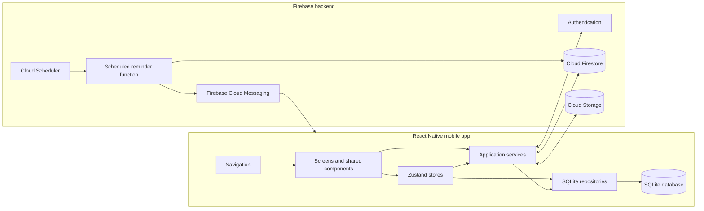

The main boundary is straightforward:

- **Frontend:** everything under `src/`. It owns screens, validation, navigation, local state, SQLite persistence, sync, PDF creation, file sharing, and notification registration.
- **Backend:** `functions/` plus managed Firebase services. It owns scheduled reminder processing, cloud data storage, authentication, protected ID-proof files, and push delivery.
- **Primary local data path:** screen → repository → SQLite. The UI does not wait for Firestore before confirming an ordinary local save.
- **Cloud data path:** repository queues a changed entity → sync service uploads it → Firestore stores the user's backup. Remote changes follow the reverse path into SQLite and then refresh the UI.

## Frontend layers

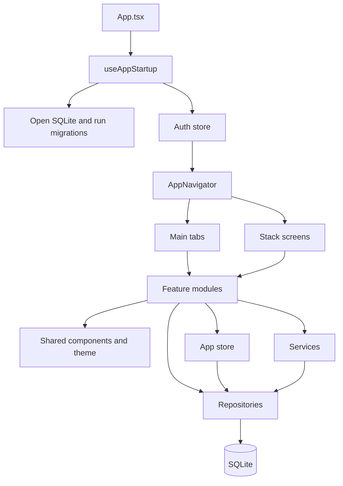

| Layer | Location | Responsibility |
| --- | --- | --- |
| Startup and navigation | `src/app` | Opens the database, initializes authentication, selects onboarding or application routes, and defines tabs and detail screens. |
| Feature UI | `src/modules` | Implements dashboard, properties, tenants, ledger, payments, receipts, reminders, settings, and move-out workflows. |
| Reusable UI | `src/components`, `src/theme` | Provides buttons, inputs, cards, screen states, icons, typography, colors, radius, and shadows. |
| In-memory state | `src/store` | Holds authentication/sync state and screen-ready property, tenant, ledger, and dashboard data. |
| Business services | `src/services` | Implements authentication, rent-cycle creation, cloud sync, receipt PDF generation, WhatsApp sharing, ID proofs, and push registration. |
| Persistence | `src/database` | Owns migrations, SQLite execution, atomic batches, entity queries, and the pending sync queue. |
| Shared contracts | `src/types`, `src/utils` | Defines domain models and shared date, currency, and ID helpers. |

### Navigation map

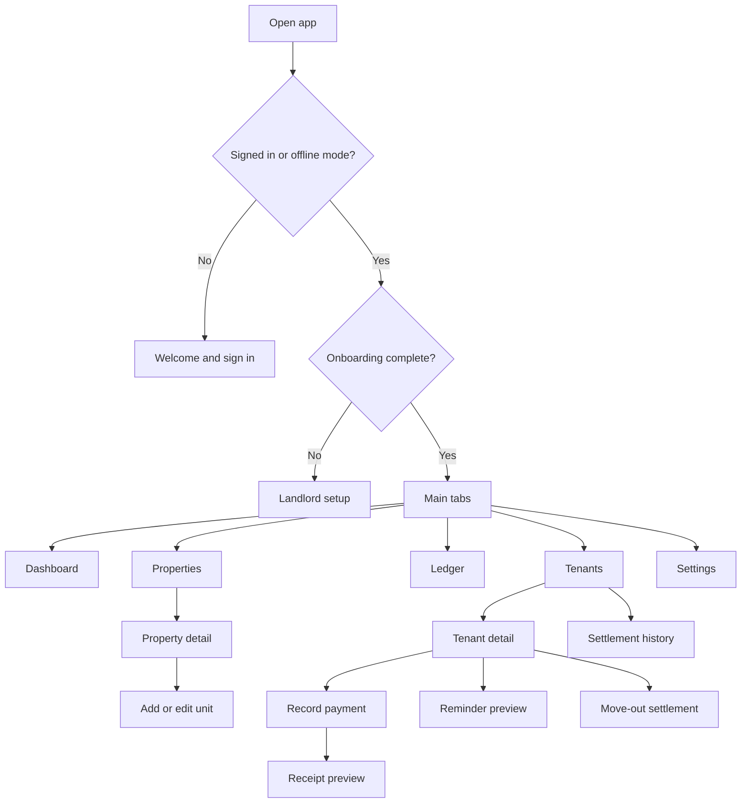

## Backend components

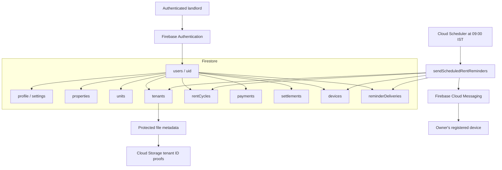

Firestore and Storage rules isolate every landlord under `users/{uid}`. The mobile application never uses an administrative backend API for ordinary data entry; Firebase SDKs enforce user access, while SQLite remains available in offline mode.

## Application startup workflow

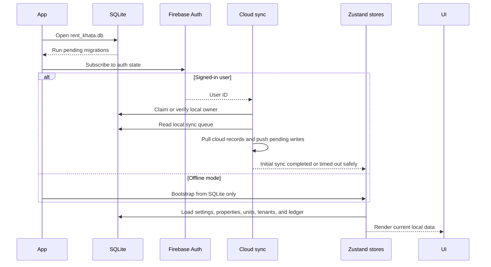

If Firebase is slow or unavailable, the app exposes offline access instead of blocking local records. Signing in later starts the same synchronization workflow.

## Local write and cloud-sync workflow

Every synchronizable entity uses the same pattern: `property`, `unit`, `tenant`, `rentCycle`, `payment`, or `settlement`.

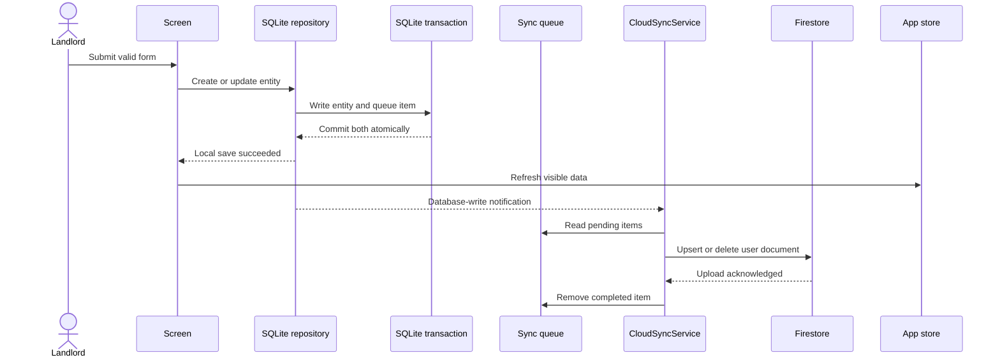

When another signed-in device changes Firestore, snapshot listeners schedule a sync. The sync service pulls cloud records into SQLite, reconciles rent-cycle totals, and asks the app store to reload the UI. Failed uploads stay in the queue and retry after another write, when the app returns to the foreground, or when the landlord selects **Settings → Sync now**.

## Property and tenant workflow

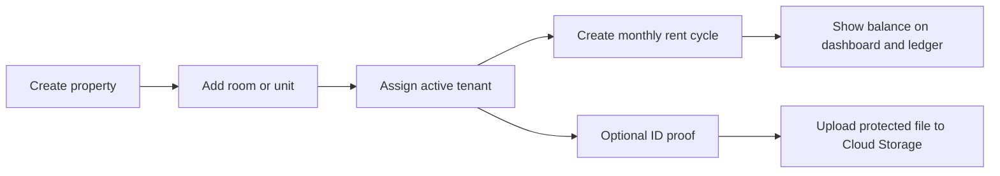

The data hierarchy is **property → unit → tenant → rent cycle → payment**. A tenant stores the agreed rent, electricity default, due day, deposit, phone, and occupancy status. Rent cycles preserve each month's bill and balance.

## Payment, receipt, and correction workflow

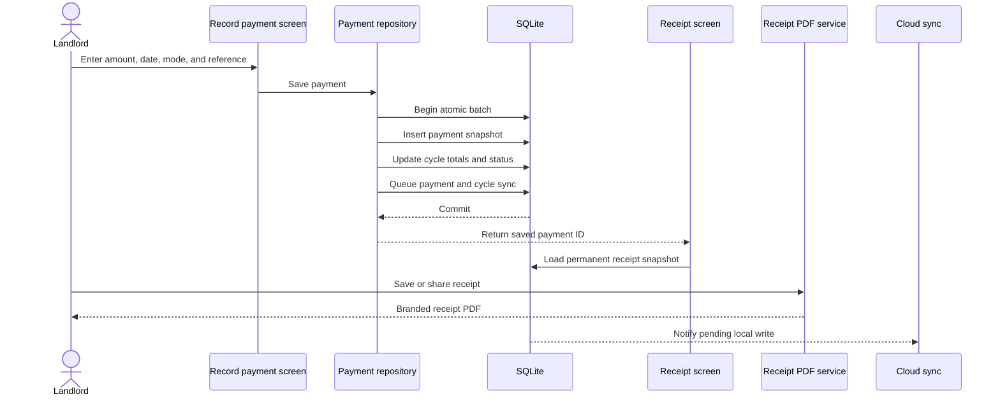

The receipt uses values captured when the payment was recorded, so later rent changes do not rewrite old receipts. Its stable identity is `KB-<payment ID>`.

For a mistake, the landlord opens the receipt, expands **Payment entered incorrectly?**, supplies a reason, and voids it. Voiding keeps an audit record, excludes the payment from totals, recalculates the rent cycle, and queues both changes for sync. A corrected payment is then recorded separately.

## Scheduled reminder workflow

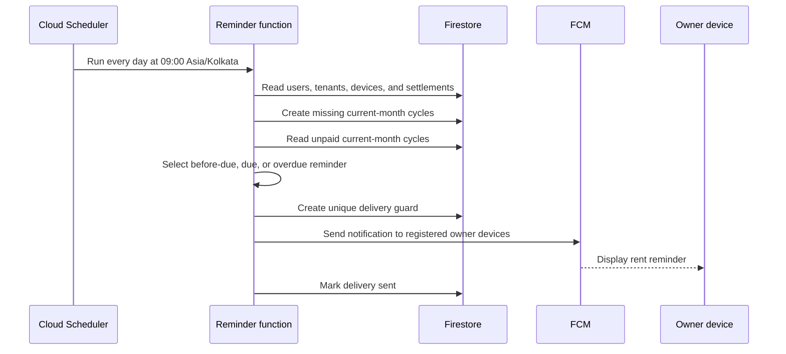

The backend excludes deleted records, settled tenants, and cycles with no balance. The unique delivery document prevents two scheduler executions from sending the same reminder twice. These notifications go to the landlord's registered devices; WhatsApp sharing from the tenant screen is the direct tenant-contact workflow.

## Move-out settlement workflow

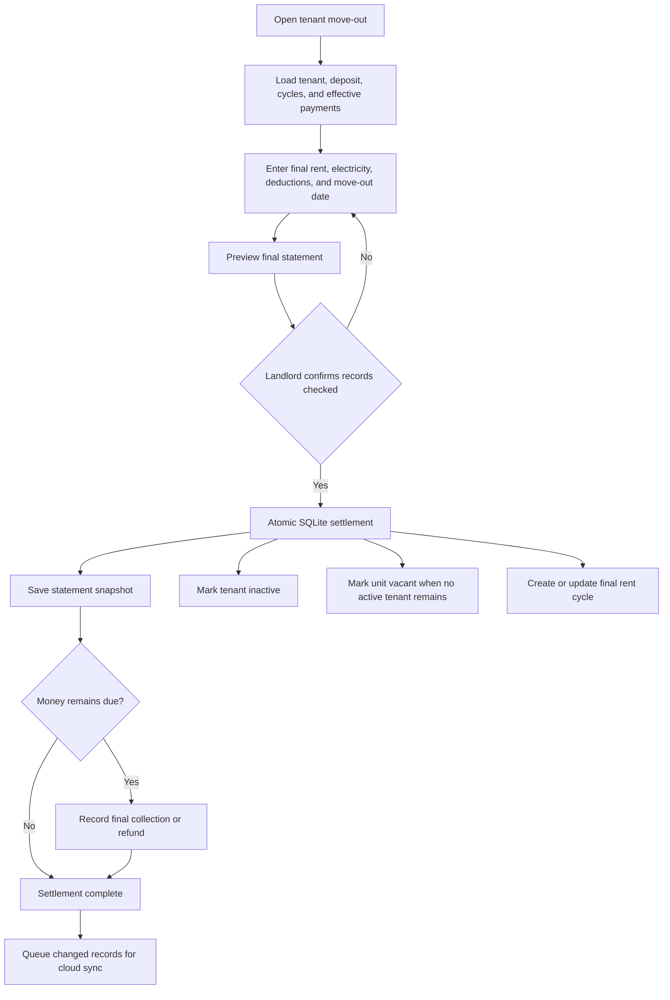

Before committing, the repository verifies that the bills and payments still match the reviewed preview. This prevents a settlement from silently using data that changed while the form was open.

## Data model

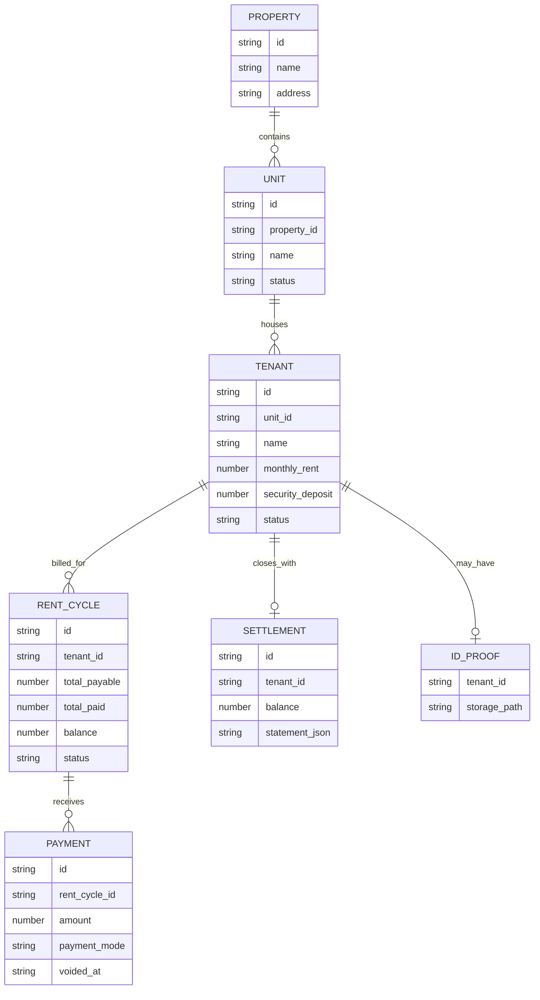

All synchronized records include ownership, timestamps, version information, and soft-deletion data. Payment snapshots and settlement statement JSON preserve historical financial context.

## Where to make a change

| Change | Start here | Usually also inspect |
| --- | --- | --- |
| Add or alter a screen | `src/modules/<feature>` | `src/app/AppNavigator.tsx`, `src/components`, `src/theme` |
| Add a tab | `src/app/MainTabs.tsx` | New screen under `src/modules` |
| Change a business rule | `src/services` or the feature repository | Tests under `__tests__` |
| Add a local field | `src/database/migrations.ts` | Model type, repository query, sync entity configuration |
| Add a synchronized entity | `src/database/repositories/syncRepo.ts` | `src/services/sync/operations.ts`, Firestore rules and indexes |
| Change receipt output | `src/modules/receipts` | `src/services/receiptPdfService.ts` |
| Change scheduled reminders | `functions/index.js` | `functions/reminderLogic.js` and its tests |
| Change ID-proof handling | `src/services/idProofService.ts` | Storage rules and Firebase setup |

When adding financial behavior, keep the entity change, derived balance update, and sync-queue records in one SQLite batch. This ensures the local UI and later cloud backup represent the same committed action.

## Verification commands

```sh
# TypeScript, lint, mobile tests, and backend tests
npm run check

# Run the Android app
npm start
npm run android

# Build a debug APK
cd android
./gradlew assembleDebug
```

Firebase provisioning, rules, deployment, and notification configuration are described in [Firebase setup](firebase-setup.md). Payment transaction and receipt guarantees are described in [Payment reliability](payment-reliability.md).
