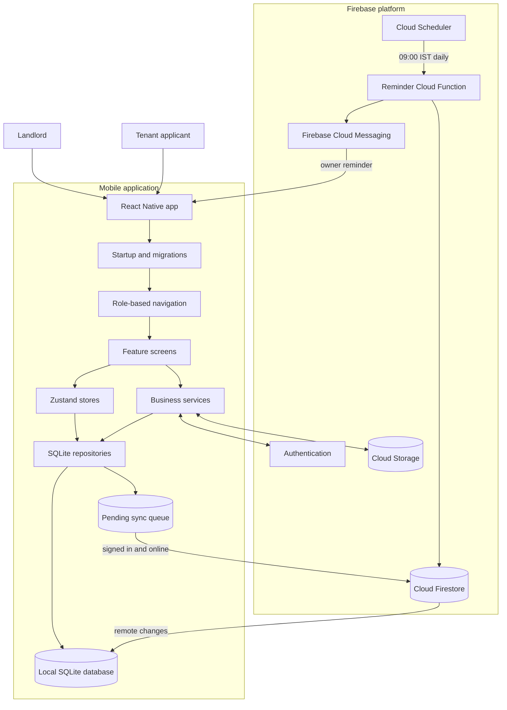
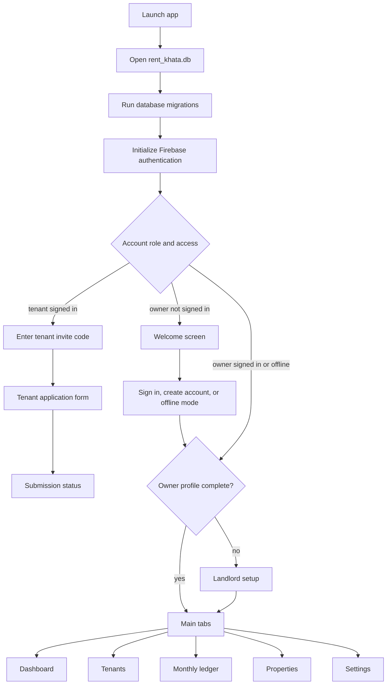
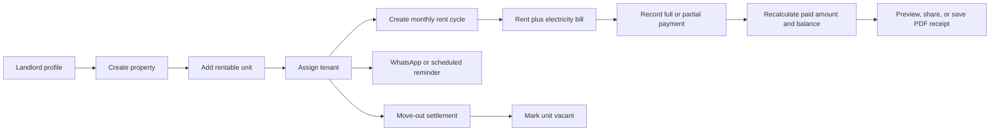
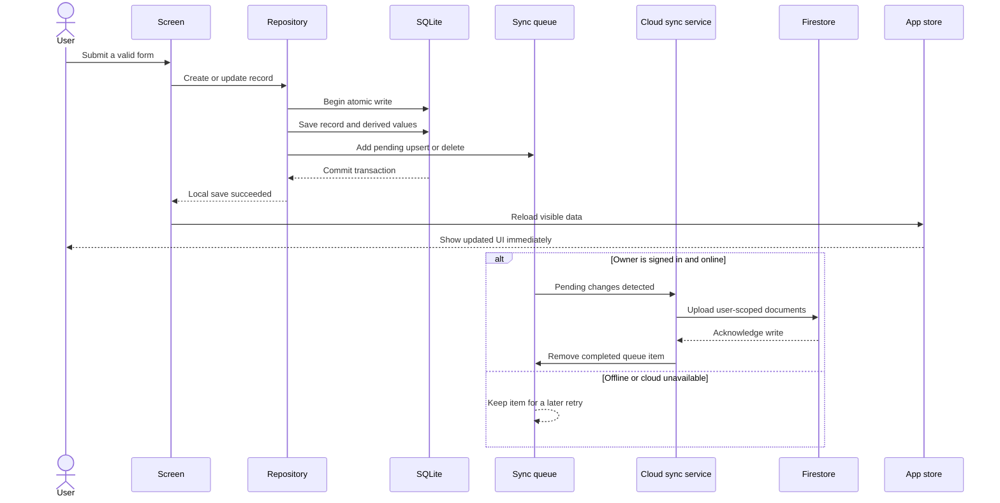
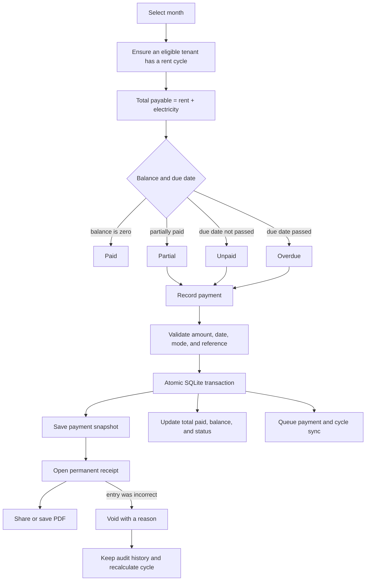
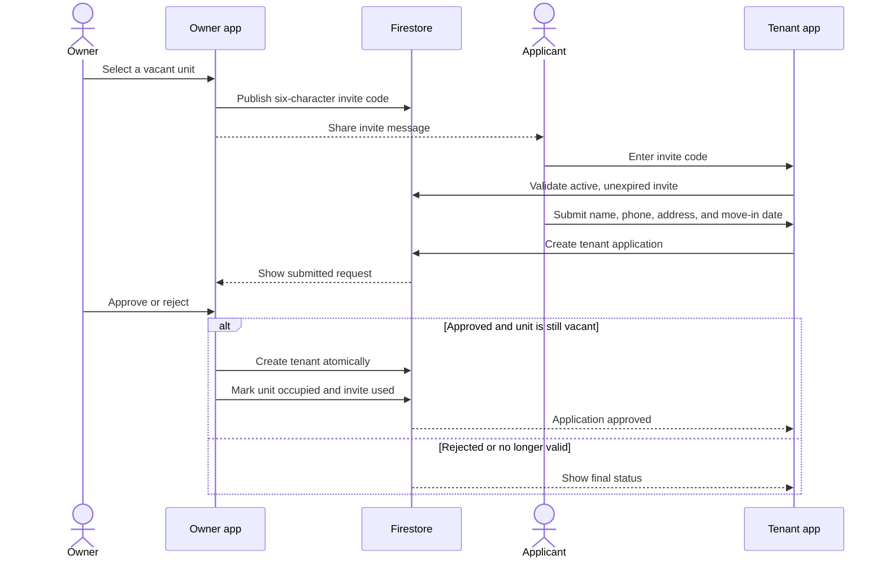
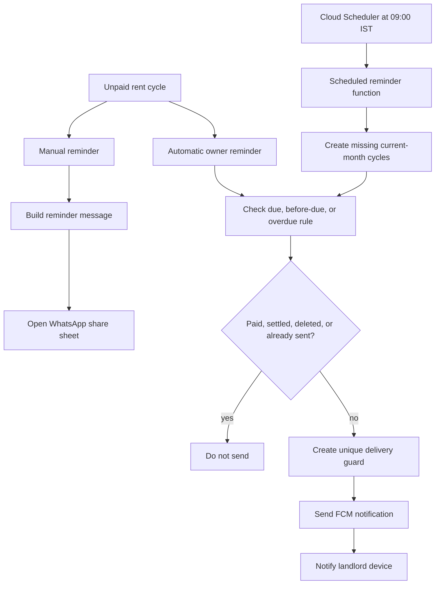
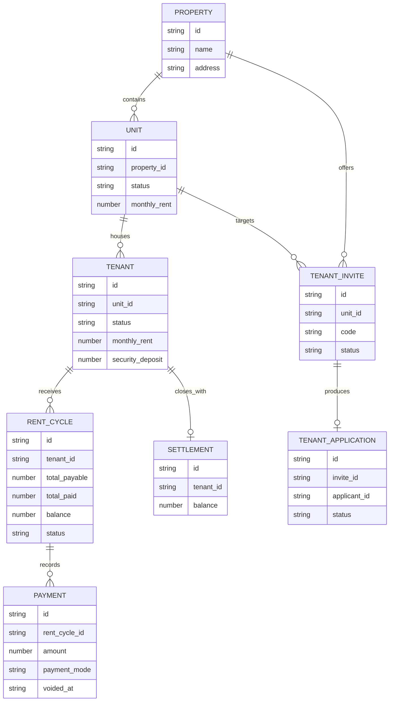

# KirayaBahi system flow

This document is a visual guide to how KirayaBahi works. The application is an
offline-first React Native rent manager: normal owner operations are saved to
SQLite first, and authenticated accounts synchronize those records with
Firebase when a network connection is available.

For implementation details about every module, see
[Architecture and module workflows](architecture.md).

## 1. Complete system overview



The important rule is **local first**. The UI confirms a normal save after the
SQLite transaction succeeds. Firestore is a synchronized cloud copy, not a
requirement for day-to-day offline work.

## 2. Application startup and navigation



On startup, `useAppStartup` opens SQLite before rendering navigation. The auth
store then observes Firebase authentication, starts cloud sync for a signed-in
owner, or loads local records when offline mode is selected.

## 3. Owner's main business flow



The core hierarchy is:

```text
Property -> Unit -> Tenant -> Monthly rent cycle -> Payment -> Receipt
```

## 4. Local write and cloud synchronization



Cloud sync also listens for Firestore changes. A remote update is pulled into
SQLite and then the app store reloads the screen data. Synchronization retries
after local writes, when the app becomes active, and when the owner chooses
**Sync now** in Settings.

## 5. Monthly rent, payment, and receipt flow



Voiding does not delete payment history. The original record is retained with
the void reason, and only non-voided payments count toward the cycle total.

## 6. Tenant invite and application flow



Invite approval is performed in a Firestore transaction so two approvals
cannot occupy the same unit or reuse the same invite.

## 7. Reminder flow



Scheduled push notifications go to the landlord's registered device. Direct
tenant contact happens through the manual WhatsApp flow.

## 8. Main data relationships



## 9. Code map

| Area | Location | Purpose |
| --- | --- | --- |
| App startup and navigation | `App.tsx`, `src/app` | Opens the database and chooses the correct role-based flow. |
| Screens | `src/modules` | Implements all user-facing workflows. |
| Shared UI | `src/components`, `src/theme` | Reusable controls, cards, typography, and styling. |
| Application state | `src/store` | Holds authentication, sync status, and screen-ready data. |
| Business logic | `src/services` | Sync, authentication, rent cycles, invites, receipts, reminders, and file uploads. |
| Local persistence | `src/database` | SQLite migrations, repositories, transactions, and sync queue. |
| Scheduled backend | `functions` | Creates missing cycles and sends owner reminders. |
| Firebase access control | `firestore.rules`, `storage.rules` | Protects each owner's cloud records and files. |

## 10. Failure behavior

- If Firebase is unavailable, existing owner data remains usable from SQLite.
- If a cloud upload fails, its queue entry remains pending for retry.
- If a SQLite transaction fails, none of that transaction's related changes
  are committed.
- If startup cannot open or migrate SQLite, the app shows an error with a
  retry action.
- If an invite is expired, cancelled, used, or its unit is occupied, the tenant
  application cannot be approved.
- Duplicate scheduled reminders are prevented by a unique delivery record.

